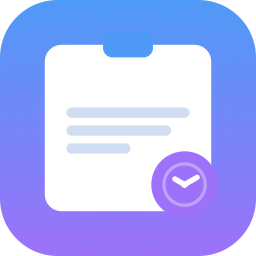
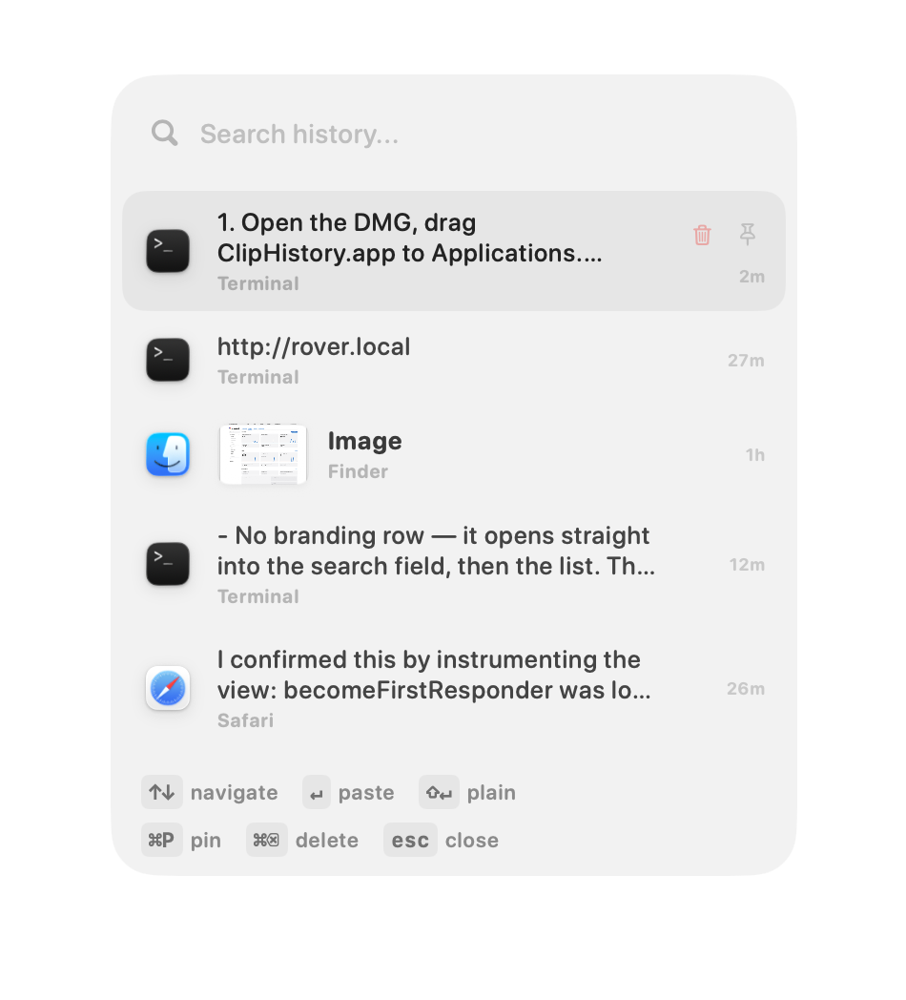

<div align="center">



# ClipHistory

**A lightweight, native macOS clipboard manager.**  
One hotkey. Instant popup. Text and images. No subscription.

[](https://github.com/jmstach/ClipHistory/actions/workflows/ci.yml)
[](https://github.com/jmstach/ClipHistory)
[](https://swift.org)
[](LICENSE)

[**Build from source**](#install) · [Repository](https://github.com/jmstach/ClipHistory)

</div>

---

## What it looks like

<div align="center">
  
</div>

---

## Why ClipHistory?

If you want 200 features, use Raycast. If you want iCloud sync, use Paste. If you just want a fast, native, free clipboard history that handles text and images — this is it.

| | |
|---|---|
| ✅ Free & open source | ✅ Text & images |
| ✅ Native Swift — ~1 MB | ✅ Pin favourites |
| ✅ Search as you type | ✅ Per-app privacy exclusions |
| ✅ Source app icons | ✅ Survives restarts |
| ✅ Launch at Login | ✅ No subscription, no telemetry |
| ✅ AES-256-GCM encrypted history | ✅ Sensitive data auto-skipped |

---

## Features

- **⚡ Instant popup** — press `⌥V` from any app, your clipboard history appears at the cursor
- **🖼 Text & images** — captures plain text, screenshots, images from Finder, browsers, Preview
- **🔍 Search** — just start typing to filter instantly; searches content and source app name
- **🎨 Styled or plain paste** — `↵` pastes with the original formatting, `⇧↵` pastes as plain text
- **📌 Pin favourites** — pinned items float to the top and are never evicted by newer copies
- **🔐 Encrypted history** — disk storage is AES-256-GCM encrypted; the key lives in your Keychain, never on disk
- **🔒 Sensitive data protection** — items marked by password managers (`org.nspasteboard.ConcealedType`) are automatically skipped before recording
- **🚫 Per-app exclusions** — block any app from being recorded; changes from excluded apps are silently ignored
- **🏷 Source app icons** — see at a glance which app each item came from
- **🪶 Truly lightweight** — ~1 MB, pure SwiftUI, no background web process, no telemetry

---

## Install

This fork has no prebuilt release — build it from source:

```bash
git clone https://github.com/jmstach/ClipHistory.git
cd ClipHistory
bash scripts/build-dmg.sh   # → dist/ClipHistory.dmg
```

Open `dist/ClipHistory.dmg`, drag **ClipHistory.app** to `/Applications`, and grant **Accessibility** permission when the onboarding screen asks — it's needed for the hotkey and the popup's keyboard navigation.

Requires macOS 14 Sonoma or later, and Xcode Command Line Tools (`xcode-select --install`).

> **Sharing the built app with someone else?** Because it isn't notarised, macOS quarantines it when copied to another Mac. They clear it once after dragging it to `/Applications`:
> ```bash
> xattr -dr com.apple.quarantine /Applications/ClipHistory.app
> ```

---

## Usage

| Action | Shortcut |
|---|---|
| Open popup | `⌥V` *(customisable in Settings)* |
| Navigate | `↑` / `↓` |
| Paste (with formatting) | `↵` |
| Paste as plain text | `⇧↵` |
| Search | Just start typing |
| Pin / unpin item | `⌘P` *(or click the pin icon on the row)* |
| Delete item | `⌘⌫` *(or click the trash icon on the row)* |
| Close | `Esc` or click outside |
| Settings | Menu bar icon → **Settings…** |

---

## Architecture

Zero dependencies. Swift Package Manager executable target.

```
Sources/ClipHistory/
├── main.swift                  # NSApplication entry point
├── AppDelegate.swift           # Menu bar, hotkey, clipboard polling timer
├── AppSettings.swift           # @Observable settings + UserDefaults persistence
├── ClipboardStore.swift        # Item store, polling, AES-256-GCM encryption, PNG thumbnailing
├── PopupWindowController.swift # NSPanel + CGEventTap keyboard intercept
├── PopupView.swift             # SwiftUI popup UI
├── PopupState.swift            # Shared search / selection state
├── SettingsView.swift          # SwiftUI settings window
├── OnboardingView.swift        # First-launch setup guide
├── HotkeyShortcut.swift        # Hotkey model + Carbon registration
├── HotkeyRecorderView.swift    # NSViewRepresentable hotkey recorder
└── MenuBarIcon.swift           # Programmatic SF Symbol menu bar icon
```

<details>
<summary><strong>Key design decisions</strong></summary>

**`NSPanel` with `.nonactivatingPanel`**  
The popup becomes the key window (so SwiftUI buttons receive clicks) without ever activating the app. The previously focused app keeps its text cursor throughout — Cmd+V fires straight into it after paste.

**Session-level `CGEventTap`**  
Keyboard events are intercepted at the OS session level while the popup is visible, routing them to search and navigation without stealing focus from the source app.

**`@Observable` + `@Bindable`**  
Modern Swift observation macros throughout — no `@StateObject` or `@ObservedObject`.

**AES-256-GCM encrypted storage**  
History is saved as `history.json.enc` — a single AES-GCM sealed box. A 256-bit key is generated on first launch and stored in the Keychain with `kSecAttrAccessibleAfterFirstUnlockThisDeviceOnly`. Saves are debounced (1 s) so clipboard bursts produce a single write.

**Sensitive data protection**  
Before recording any clipboard event, the store checks for `org.nspasteboard.ConcealedType` — the standard pasteboard type that 1Password and other credential managers set. Items carrying it are silently dropped.

**Image thumbnailing**  
Clipboard images (screenshots, browser copies, Finder files) are downscaled to ≤ 480 px PNG at capture time using `NSImage(size:flipped:drawingHandler:)`, which forces lazy clipboard images that report `size=(0,0)` to render before sampling. Decoded `NSImage` instances are cached in `NSCache` keyed by item UUID to avoid re-inflating PNG bytes on every render pass.

</details>

---

## Contributing

Issues and pull requests are welcome.  
Please **open an issue first** before starting any large change so we can discuss the approach.

---

## License

[MIT](LICENSE) © 2026 Weiyuan Kong
